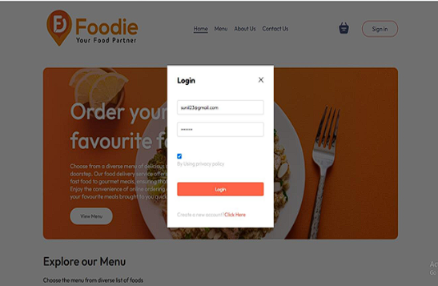
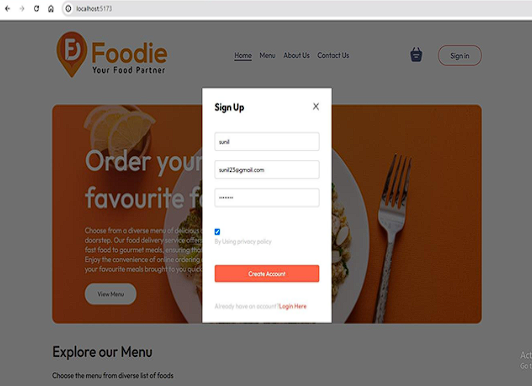
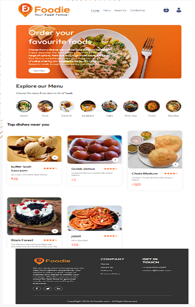
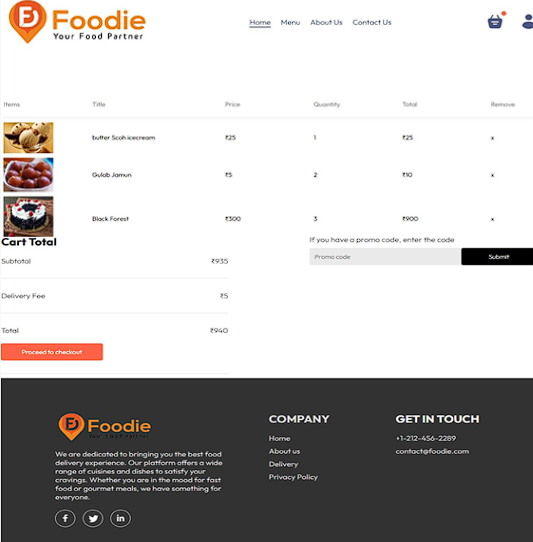
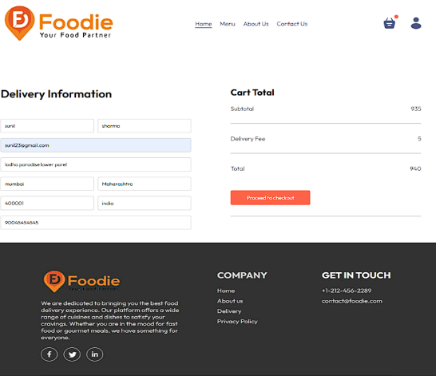
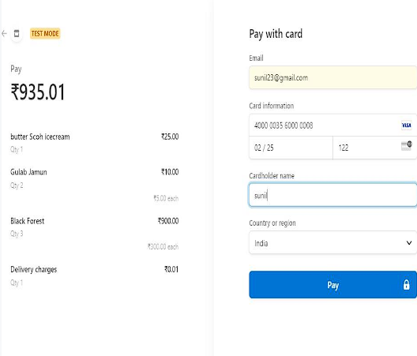
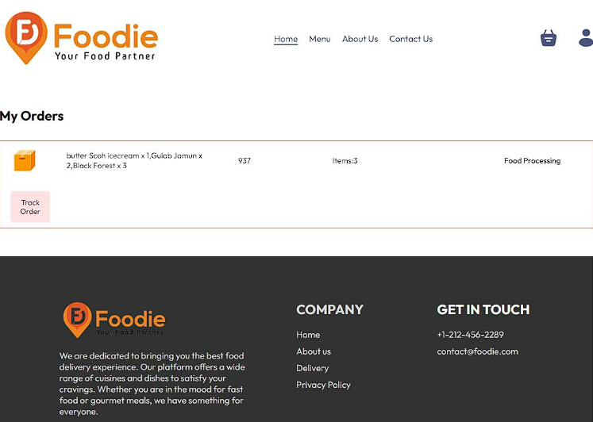
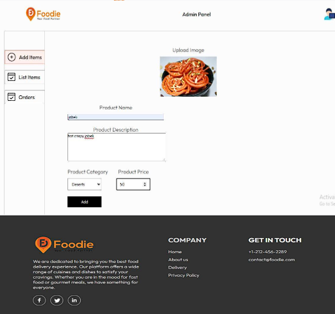
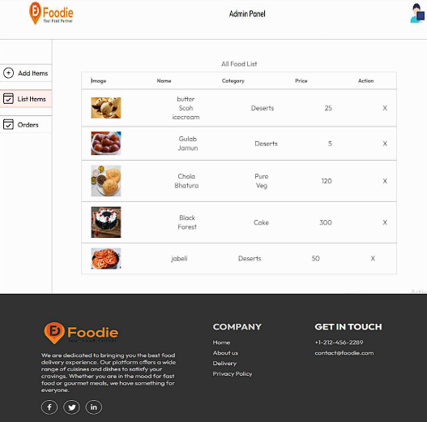
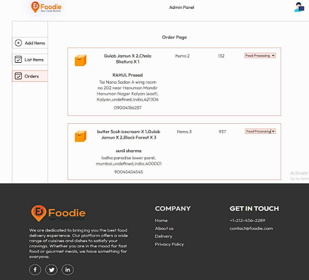

# Foodie: An Online Food Ordering Website

---

## Project Overview

Foodie is an online food ordering platform built using the MERN stack. It provides users with an intuitive interface for browsing menus, placing orders, and managing food items. The platform also includes an admin module for managing menu items, tracking orders, and integrating secure payment processing through Stripe.

---

## Features

- **User Interface:**
  - Browse food items by categories.
  - Add items to the cart and place orders.
  - View order history and order status.
  
- **Admin Module:**
  - Add, update, and delete menu items.
  - Track and manage orders.
  - Secure payment processing using Stripe.
  
- **Security:**
  - JWT authentication for secure login and session management.

---

## Technologies Used

- **Frontend:** React
- **Backend:** Node.js, Express.js
- **Database:** MongoDB
- **Payment Gateway:** Stripe
- **Authentication:** JWT (JSON Web Tokens)

---

## Installation

1. **Clone the repository:**
   ```bash
   git clone https://github.com/Akash-oss446/Foodie-An-Online-Food-Order-Delivery.git
   cd Foodie-An-Online-Food-Order-Delivery
---
## Screenshot

1.Login



2.Signup



3.User Dashboard



4.Usercart



5.Payment information



6.Payment Gateway



7.Orders



Admin Panel

1.Add Items



2.List Item



3.View Orders 


